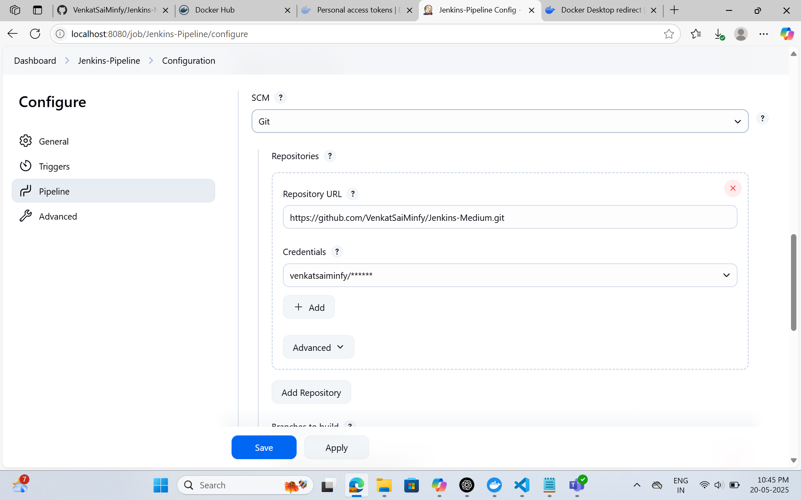
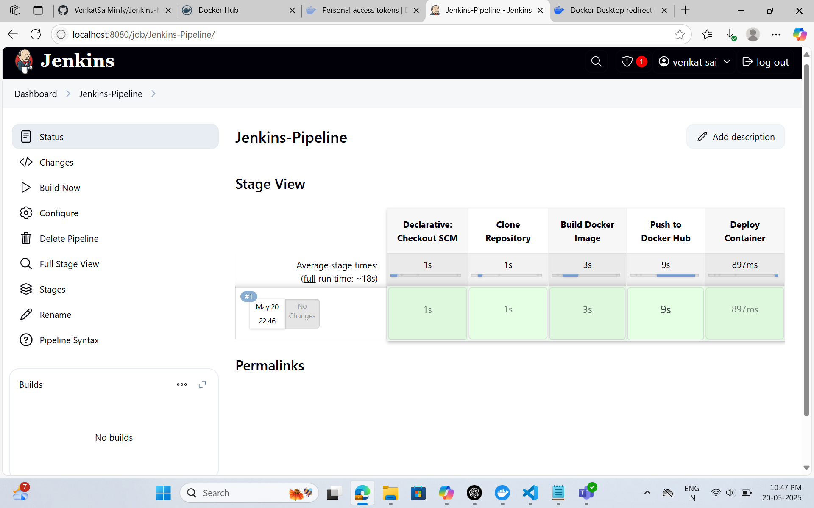

## Docker Pull Jenkins
docker run --user root -p 8080:8080 -p 50000:50000 --restart=on-failure -d -v /var/run/docker.sock:/var/run/docker.sock -v jenkins_home:/var/jenkins_home --name jenkins-docker jenkins/jenkins:lts-jdk17

## Docker Exe Jenkins 
docker exec -it jenkins-docker bash

## Install Docker
apt update && apt install -y docker.io

## Create Access Tokens with READ,WRITE,DELETE from DOCKER HUB

## Add Credentials in the following path via Jenkins Dashboard
Dashboard/Manage Jenkins/Credentials/System/Global credentials (unrestricted)

## Create New item With Jenkins-pipeline using pipeline item type

## Add the following configuration and Save it

## Final Output
